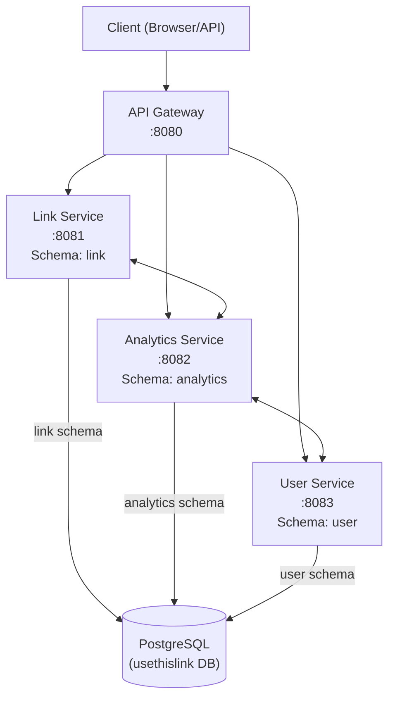
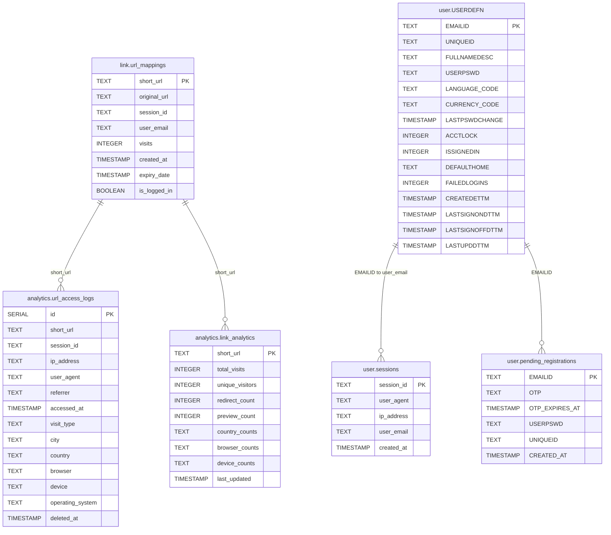

# UseThisLink: Functionality-Wise Breakdown

**Name**: UseThisLink  
**Goal**: A scalable, production-ready URL shortening service with click tracking and basic analytics, built in Go with SQLite.  
**Target**: Impress recruiters/tech leads with modern engineering practices and offer a monetizable foundation (e.g., premium features later).

---

## Functionality-Wise Breakdown

### 1. Project Setup & Core Infrastructure
**What**: Establish the foundation—code structure, dependencies, database, and basic server.  
**Why**: Sets the stage for a clean, maintainable app.  
**Tasks**:  
- **Init Project**: 
  - `mkdir usethislink && cd usethislink && go mod init usethislink`
  - Install: `go get github.com/gorilla/mux github.com/sirupsen/logrus github.com/joho/godotenv github.com/mattn/go-sqlite3`
- **Structure**:
```
usethislink/
├── CONTRIBUTING.md
├── DesignDocument.md
├── LICENSE
├── README.md
├── api
│   └── handlers.go
├── cmd
│   └── main.go               
├── go.mod
├── go.sum
├── internal                   
│   ├── analytics
│   │   ├── geolocation.go
│   │   └── useragent.go
│   ├── db
│   │   ├── db.go         
│   │   └── usethislink.db
│   ├── mw
│   │   └── session.go
│   └── shortner
│       └── shortner.go
├── static
└── templates
    └── index.html
```

- **SQLite Setup** (`internal/db/db.go`): 
- Table: `urls (id INTEGER PRIMARY KEY AUTOINCREMENT, original_url TEXT NOT NULL, short_code TEXT UNIQUE NOT NULL, created_at TIMESTAMP, click_count INTEGER)`
- Function: `InitDB(dbPath string) (*sql.DB, error)` to connect and create table
- **Basic Server** (`cmd/main.go`): 
- `/health` endpoint: `{"status": "ok"}`
- Load `.env` (e.g., `PORT=8080`, `DB_PATH=usethislink.db`, `BASE_URL=http://localhost:8080`)

---

### 2. Data Models & Shortening Logic
**What**: Define the URL data structure and logic to generate short codes.  
**Why**: Core of the app—how links are stored and created.  
**Tasks**:  
- **Model** (`internal/models/url.go`): 
- Struct: `URL {ID int64, Original string, ShortCode string, CreatedAt time.Time, ClickCount int}`
- **Shortening Logic** (`internal/shortener/shortener.go`): 
- Function: `GenerateShortCode() string`—6-char base62 (`a-zA-Z0-9`) using `crypto/rand`
- Collision check: Query DB, regenerate if exists
- **DB Interaction** (`internal/db/db.go`): 
- `SaveURL(url models.URL) (models.URL, error)`: Insert into `urls`, return populated struct

---

### 3. API Endpoints
**What**: Build RESTful endpoints for shortening, redirecting, and stats.  
**Why**: User-facing functionality that showcases API design skills.  
**Tasks**:  
- **POST /shorten** (`api/handlers.go`): 
- Input: `{"url": "https://example.com/long-url"}`
- Output: `{"short_url": "http://localhost:8080/Ab1XyZ"}`
- Validate URL with `net/url`
- **GET /{shortcode}**: 
- Fetch `original_url` from DB, increment `click_count`, redirect (HTTP 302)
- **GET /stats/{shortcode}**: 
- Return: `{"original_url": "...", "click_count": 42, "created_at": "..."}`
- **Routing**: Use `gorilla/mux` for clean path handling

---

### 4. Error Handling & Logging
**What**: Add robustness with proper errors and logs.  
**Why**: Production-grade apps need reliability and traceability.  
**Tasks**:  
- **Error Handling**: 
- Validate inputs (e.g., 400 for invalid URLs)
- 404 for unknown shortcodes
- JSON errors: `{"error": "message"}`
- **Logging**: 
- Use `logrus` to log to `logs/usethislink.log`
- Log requests (method, path, duration) and key actions (e.g., "Shortened URL: Ab1XyZ")
- **Middleware**: Wrap handlers to log every request

---

### 5. Testing
**What**: Write unit tests for critical components.  
**Why**: Shows you care about quality—huge for tech leads.  
**Tasks**:  
- **Tests** (`tests/shortener_test.go`): 
- `GenerateShortCode()`: Check length, uniqueness
- Redirect: Mock DB, verify 302
- Stats: Mock data, check JSON
- **Tools**: Use `testing` and `github.com/stretchr/testify/assert`
- **Goal**: ~70% coverage on `internal/shortener`

---

### 6. Deployment Prep
**What**: Package and deploy the app.  
**Why**: Proves it's not just a toy—ready for the real world.  
**Tasks**:  
- **Config**: 
- `.env` for `PORT`, `DB_PATH`, `BASE_URL`
- **Dockerfile**:
```
  FROM golang:1.21-alpine
  WORKDIR /app
  COPY . .
  RUN go build -o usethislink ./cmd/main.go
  CMD ["./usethislink"]
```

- **Deploy**: 
- Test: `docker build -t usethislink . && docker run -p 8080:8080 usethislink`
- Push to Fly.io/Render (free tier, persist SQLite)

---

### 7. Polish & Presentation
**What**: Document and showcase the project.  
**Why**: Makes it recruiter-ready and shareable.  
**Tasks**:  
- **README.md**: 
- Purpose: "Production-grade URL shortener with analytics"
- Setup, API examples:
  ```
  curl -X POST -d '{"url": "https://example.com"}' http://localhost:8080/shorten
  curl http://localhost:8080/Ab1XyZ # Redirects
  curl http://localhost:8080/stats/Ab1XyZ
  ```

---
#Potential - Distributed over monolithic
1. Prerequisites Before Refactoring
Familiarity with Docker:
All services will run in local Docker containers. Ensure you and your team are comfortable with Docker Compose for multi-container orchestration.
Automated Tests:
If you don't have tests, add basic ones. Refactoring without tests is risky.
CI Pipeline (Optional but recommended):
Set up a simple CI to run tests and build Docker images.
Database Migration Plan:
You're using SQLite. Decide on a networked DB (e.g., Postgres) and plan for schema migration.
Service Communication:
Decide on REST/gRPC for inter-service calls. REST is easier for a first split.
2. Analyze Your Current Codebase Structure
cmd/main.go:
Entry point, likely wires everything together.
api/handlers.go:
HTTP handlers, probably mixes business logic and HTTP.
internal/db/:
DB access, currently SQLite.
internal/shortner/:
Link shortener logic.
internal/analytics/:
Analytics logic (geolocation, user agent).
internal/mw/:
Middleware (e.g., session management).
3. How to Split the Codebase
A. Identify Service Boundaries
Based on your folders, a natural split is:
Service Name	What to Move/Extract	New DB?
Link Service	internal/shortner/, relevant handlers in api/	Yes
Analytics Service	internal/analytics/, analytics handlers in api/	Yes/Shared
User/Auth Service	Session logic in internal/mw/, user handlers in api/	Yes
API Gateway	Thin HTTP layer, routes to other services	No
Note:
Each service gets its own Dockerfile and runs as a container.
Each service should have its own DB schema (can share a DB instance, but separate tables).
B. Step-by-Step Refactoring Plan
Step 1: Decouple Business Logic from HTTP Handlers
Move business logic out of api/handlers.go into service-specific packages.
Handlers should only handle HTTP, call business logic via interfaces.
Step 2: Extract Services into Separate Folders/Modules
Create a new top-level folder for each service:
/services/link/
/services/analytics/
/services/user/
Move relevant code from internal/ and api/ into these folders.
Step 3: Define Service Interfaces
For each service, define clear interfaces for what it exposes (e.g., REST endpoints).
Remove direct function calls between services; replace with HTTP/gRPC calls.
Step 4: Database Refactor
Migrate from SQLite to a networked DB (e.g., Postgres).
Each service manages its own tables.
Use Docker Compose to run DB containers locally.
Step 5: Dockerize Each Service
Add a Dockerfile to each service folder.
Use Docker Compose to orchestrate all services and the DB.
Step 6: Implement an API Gateway
Create a lightweight gateway service that routes external requests to the correct internal service.
Handles cross-cutting concerns (auth, rate limiting, etc.).
Step 7: Shared Libraries (Optional)
If you have code used by multiple services (e.g., models, utils), move it to a /pkg/ folder or a Go module.
4. Example Mapping from Current to New Structure
Current Location	New Location (Service)	Notes
internal/shortner/	/services/link/	All link logic
internal/analytics/	/services/analytics/	All analytics logic
internal/mw/session.go	/services/user/	Session/user logic
api/handlers.go	Split among services	Move handler logic to relevant service
internal/db/	Each service /db/	Each service manages its own DB access
5. What NOT to Do
Don't try to split everything at once.
Start with one service (e.g., Link Service), get it running in Docker, then move to the next.
Don't share internal Go packages between services.
If you need shared code, make a /pkg/ or a Go module.
Don't keep SQLite for distributed services.
Move to a networked DB before splitting.
6. Next Steps Checklist
[ ] Set up Docker Compose for local orchestration.
[ ] Choose and set up a networked DB (Postgres recommended).
[ ] Decouple business logic from HTTP handlers.
[ ] Move code into service-specific folders.
[ ] Dockerize each service.
[ ] Implement inter-service communication (REST/gRPC).
[ ] Add an API Gateway.
[ ] Update tests to work with new structure.

# UseThisLink: Distributed Microservices Design

## System Architecture (Mermaid Diagram)



---

## Database ERD (Mermaid)



---

## Table & Column Explanations

### link.url_mappings
- **short_url**: (PK) The unique shortcode for the shortened URL.
- **original_url**: The original, long URL.
- **session_id**: Session that created the link (anonymous or logged-in).
- **user_email**: Email of the user who created the link (if logged in).
- **visits**: Number of times the link was visited.
- **created_at**: Timestamp when the link was created.
- **expiry_date**: When the link expires (optional).
- **is_logged_in**: Whether the creator was logged in.

### analytics.url_access_logs
- **id**: (PK) Auto-incremented log entry ID.
- **short_url**: The shortcode that was accessed.
- **session_id**: Session of the visitor.
- **ip_address**: IP address of the visitor.
- **user_agent**: Browser user agent string.
- **referrer**: HTTP referrer.
- **accessed_at**: Timestamp of access.
- **visit_type**: 'redirect' or 'preview'.
- **city/country**: Geolocation info.
- **browser/device/operating_system**: Parsed device info.
- **deleted_at**: Soft-delete timestamp (optional).

### analytics.link_analytics
- **short_url**: (PK) The shortcode being aggregated.
- **total_visits**: Total number of visits.
- **unique_visitors**: Unique session/user count.
- **redirect_count**: Number of redirects.
- **preview_count**: Number of preview page views.
- **country_counts/browser_counts/device_counts**: JSON blobs with per-country/browser/device stats.
- **last_updated**: Last time stats were updated.

### user.USERDEFN
- **EMAILID**: (PK) User's email address.
- **UNIQUEID**: Unique user identifier (UUID).
- **FULLNAMEDESC**: Full name/description.
- **USERPSWD**: Hashed password.
- **LANGUAGE_CODE**: Preferred language.
- **CURRENCY_CODE**: Preferred currency.
- **LASTPSWDCHANGE**: Last password change timestamp.
- **ACCTLOCK**: Account lock status (0/1).
- **ISSIGNEDIN**: Is user currently signed in (0/1).
- **DEFAULTHOME**: Default home page/route.
- **FAILEDLOGINS**: Failed login attempts.
- **CREATEDETTM**: Account creation timestamp.
- **LASTSIGNONDTTM**: Last sign-on timestamp.
- **LASTSIGNOFFDTTM**: Last sign-off timestamp.
- **LASTUPDDTTM**: Last update timestamp.

### user.pending_registrations
- **EMAILID**: (PK) Email for pending registration.
- **OTP**: One-time password for verification.
- **OTP_EXPIRES_AT**: When the OTP expires.
- **USERPSWD**: Hashed password (pending).
- **UNIQUEID**: UUID for the pending user.
- **CREATED_AT**: When the registration was started.

### user.sessions
- **session_id**: (PK) Session identifier (cookie value).
- **user_agent**: Browser user agent string.
- **ip_address**: IP address of the session.
- **user_email**: Email of the logged-in user (if any).
- **created_at**: When the session was created.

---

## Notes
- Each service manages its own schema and tables for isolation and security.
- All inter-service communication is via HTTP, never direct DB access.
- The ERD shows logical relationships; foreign keys may not be enforced at the DB level for cross-schema links.